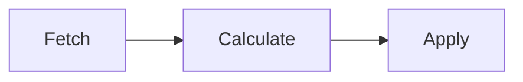

# kbridge — Kafka Consumer Offset Migration Tool by Kannika.io

[](https://github.com/kannika-io/kbridge/actions/workflows/ci.yml)


> Migrate and restore Kafka consumer group offsets between clusters — for cluster migrations, disaster recovery, and environment promotion.  
> Developed and maintained by [Kannika.io](https://kannika.io) — the Kafka reliability platform.

`kbridge` is an open-source CLI tool built in Rust that makes Kafka consumer offset migration safe, predictable, and scriptable. Whether you're moving to Confluent Cloud, recovering from a cluster failure, or syncing consumer state between environments, kbridge gives you full control with a simple three-step pipeline.

## What is Kannika.io?

[Kannika.io](https://kannika.io) builds open-source and commercial tools for Kafka reliability, observability, and operations. `kbridge` is part of our toolchain for teams running Kafka in production.

---

## Quick Start

### Basic Commands

```bash
# Show help
kbridge --help

# Show help for specific command
kbridge fetch --help
kbridge calculate --help
kbridge apply --help
```

### Simple Local Example

Against local source (localhost:9092) and target (localhost:9093) clusters:

```bash
# Step 1: Fetch offsets from source cluster
kbridge fetch -b localhost:9092 > source_offsets.csv

# Step 2: Calculate target offsets
kbridge calculate -b localhost:9093 -H Offset -i source_offsets.csv > target_offsets.csv

# Step 3: Apply target offsets (with confirmation prompt)
kbridge apply -b localhost:9093 -i target_offsets.csv
```

### Chained Pipeline

All steps can be chained together for streamlined execution:

```bash
kbridge fetch -b localhost:9092 | \
kbridge calculate -b localhost:9093 -H Offset | \
kbridge apply -b localhost:9093
```

> ⚠️ **Safety First**: Before applying offsets, a confirmation prompt is shown to prevent accidental modifications. The prompt can be skipped by adding the '-y' flag to the apply step (See help section for more info).

### CSV Format

The tool uses CSV format for offset data with the following columns:

```csv
consumer_group,topic,partition,offset
my-consumer-group,orders,0,12345
my-consumer-group,orders,1,12346
my-consumer-group,payments,0,5678
```

## Installation

### Using Cargo

```bash
cargo install --git https://github.com/cymo-eu/kannika-bridge.git kbridge
```

### From Releases

1. Download the latest binary for your platform from the [releases page](https://github.com/cymo-eu/kannika-bridge/releases)
2. Extract the archive
3. Move the `kbridge` binary to a directory in your `$PATH`

### Linux

```bash
# Download and install (replace VERSION with actual version)
curl -L https://github.com/cymo-eu/kannika-bridge/releases/download/vVERSION/kbridge-linux.tar.gz | tar xz
sudo mv kbridge /usr/local/bin/
```

### macOS

No installation possible. In a later release, installation via Docker will be added.

### Build from Source

```bash
git clone https://github.com/cymo-eu/kannika-bridge.git
cd kannika-bridge
cargo build --release
# Binary will be in target/release/kbridge
```

## How does it work

The restoration comes in 3 steps. 
Each of these steps can be performed separately and the result can be checked before proceeding to the next step.



1. **Fetch** - Grabs all committed consumer group offsets from your source cluster and dumps them to CSV.

2. **Calculate** - Takes a CSV of source offsets and figures out the equivalent offset on the target cluster. It does this by looking for messages that have the source offset stored in a header (offsets differ between clusters, but the header tells us which message is which). Outputs another CSV with the mapped target offsets.

3. **Apply** - Takes the transformed CSV and commits those offsets to the target cluster so your consumers can resume right where they left off.

### Use Cases

- **Cluster Migration**: Move consumer groups from one Kafka cluster to another
- **Disaster Recovery**: Restore consumer positions after cluster failures
- **Environment Promotion**: Sync consumer states between dev/staging/production
- **Data Replication**: Maintain consumer offset consistency across replicated clusters

### Prerequisites

- Kafka clusters must be accessible via bootstrap servers and credentials
- Messages on target cluster must contain **source offset information** in headers (for transformation step) the name of the header is configurable
- Appropriate permissions to read consumer group metadata and commit offsets (see [Required Kafka Permissions](#required-kafka-permissions))

## Required Kafka Permissions

`kbridge` only reads records and commits consumer group offsets.
It never produces records,
never creates or deletes topics,
and never uses the Kafka admin API.

Each step requires a different set of ACLs on the cluster it connects to.
The tables below list the minimal ACLs per step,
using the standard Kafka operation and resource type terminology.

### Fetch (source cluster)

`fetch` lists all consumer groups and topics on the source cluster,
and reads the committed offsets of every group.

| Operation | Resource | Used for |
|-----------|----------|----------|
| Describe  | Cluster | Listing all consumer groups (`ListGroups`) |
| Describe  | Group: all groups | Describing groups and reading their committed offsets (`DescribeGroups`, `OffsetFetch`) |
| Describe  | Topic: all topics | Fetching cluster metadata (`Metadata`) |

Topic filters (`-t`) are applied client-side,
so `fetch` requests metadata and offsets for **all** topics even when filters are set.

### Calculate (target cluster)

`calculate` consumes records from the target topics to find the offsets that match the source offsets.
It assigns partitions manually and never joins a consumer group,
so it does not require any Group ACLs.

| Operation | Resource | Used for |
|-----------|----------|----------|
| Describe  | Topic: topics in the input CSV | Fetching topic metadata and watermarks (`Metadata`, `ListOffsets`) |
| Read      | Topic: topics in the input CSV | Consuming records to inspect the offset header (`Fetch`) |

### Apply (target cluster)

`apply` commits the calculated offsets on behalf of each consumer group in the input CSV.

| Operation | Resource | Used for |
|-----------|----------|----------|
| Read      | Group: each group in the input CSV | Committing offsets (`OffsetCommit`) |
| Read      | Topic: topics in the input CSV | Authorizing the topics whose offsets are committed (`OffsetCommit`) |

With `--dry-run`, `apply` does not contact the cluster and requires no permissions.

### Notes

- Offsets are committed through the regular consumer protocol,
  not through the admin API,
  so no `Alter` ACLs are needed.
- `fetch` connects with the group id `bridge-consumer-group` unless `group.id` is overridden with `-p`.
- `calculate` connects with the group id `kbridge`,
  but never commits offsets with it,
  so it does not appear as an active group on the cluster.
- If the brokers allow automatic topic creation for metadata requests,
  a typo in a topic name can create an unwanted topic.
  Granting only `Describe` (and not `Create`) prevents this.

## Advanced Options

#### Filter by Topics

```bash
# Only process specific topics
kbridge fetch -b localhost:9092 -t topic1 -t topic2 -t topic3
```

#### Custom Header Key

```bash
# Use custom header key for offset mapping
kbridge calculate -b localhost:9093 -H CustomOffsetHeader -i offsets.csv
```

### Dry Run

To see what offsets would be applied without actually committing them,
use the `--dry-run` flag.

```bash
# Calculate and review target offsets before applying
kbridge fetch -b source:9092 | \
kbridge calculate -b target:9093 -l Offset \
kbridge apply -b target:9093 -i - --dry-run
```

#### SASL/SSL (Confluent Cloud)

```bash
kbridge fetch -b <bootstrap-url> \
    -o security.protocol=sasl_ssl \
    -o sasl.mechanism=PLAIN \
    -o sasl.username=<api-key> \
    -o sasl.password=<api-secret> \
    -o ssl.ca.location=probe
```

#### SASL/PLAINTEXT

```bash
kbridge fetch -b <bootstrap-url> \
    -o security.protocol=sasl_plaintext \
    -o sasl.mechanism=SCRAM-SHA-256 \
    -o sasl.username=<username> \
    -o sasl.password=<password>
```

#### SSL with Client Certificates

```bash
kbridge fetch -b <bootstrap-url> \
    -o security.protocol=ssl \
    -o ssl.ca.location=/path/to/ca-cert \
    -o ssl.certificate.location=/path/to/client-cert \
    -o ssl.key.location=/path/to/client-key
```

## Troubleshooting

### Common Issues

#### "Consumer group not found"
- Ensure the consumer group exists on the target cluster
- Verify you have permissions to read consumer group metadata

#### "No headers in message" or "Header not found"
- Messages on the target cluster must contain source offset information in headers
- Verify the header key matches what you specified with `-H` flag
- Check that your replication process is preserving message headers

#### "Kafka Error: Authentication failed"
- Verify your authentication credentials
- Check that security protocol matches your cluster configuration
- Ensure your user has necessary permissions (read consumer groups, commit offsets)

#### "Connection refused"
- Verify bootstrap server addresses are correct and accessible
- Check network connectivity and firewall rules
- Ensure Kafka cluster is running and healthy

## Logging

By default, kbridge logs at `info` level with internal Kafka client logs suppressed for cleaner output.

### Verbose Mode

Use `-v` or `--verbose` to enable detailed logging including Kafka client internals:

```bash
kbridge --verbose fetch -b localhost:9092
```

### Custom Log Levels

Override logging via the `RUST_LOG` environment variable:

```bash
# Debug level for all components
RUST_LOG=debug kbridge fetch -b localhost:9092

# Info level with Kafka warnings visible
RUST_LOG=info,rdkafka=warn kbridge fetch -b localhost:9092

# Trace specific modules
RUST_LOG=bridge_core::kafka=trace kbridge fetch -b localhost:9092
```

When `RUST_LOG` is set, it takes precedence over the `--verbose` flag.

## Contributing

1. Fork the repository
2. Create a feature branch (`git checkout -b feature/amazing-feature`)
3. Commit your changes (`git commit -m 'Add amazing feature'`)
4. Push to the branch (`git push origin feature/amazing-feature`)
5. Open a Pull Request

### Development Setup

```bash
# Clone the repository
git clone https://github.com/cymo-eu/kannika-bridge.git
cd kannika-bridge

# Install Rust (if not already installed)
curl --proto '=https' --tlsv1.2 -sSf https://sh.rustup.rs | sh

# Build the project
cargo build

# Run tests
cargo test

# Run with sample data
cargo run -- fetch -b localhost:9092
```

## License

TODO

## Support

- 🐛 [Issue Tracker](https://github.com/cymo-eu/kannika-bridge/issues)
