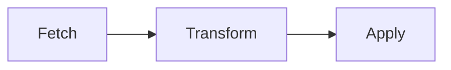

# Kannika Bridge 🌉

[](https://github.com/cymo-eu/kannika-bridge/actions/workflows/ci.yml)

> ✉️ 🚀 Restore consumer offsets on kafka cluster.

## How does it work

The restoration comes in 3 steps:



1. **Fetch** source offsets from the source cluster
2. **Offsets** transformation: we look at the offsets of the corresponding topic/partition on the target cluster
3. **Apply** transformed offsets to the cluster

## Installation

### Linux

- Download binary
- Add binary to $PATH variable

## Usage

Simple usage against local cluster:

```bash
# Show help
bridge-cli --help

# Fetch offsets
bridge-cli fetch-source -b localhost:9092 > offsets.csv

# Calculate target offsets
bridge-cli calculate-target --bootstrap-server localhost:9093 --legacy-offset-header Offset --source-offsets-csv-file-location ./offsets.csv > target_offsets.csv

# Apply target offsets
bridge-cli apply-target -b localhost:9093 -i ./target_offsets.csv

# Chaining the 3 steps together is also possible
bridge-cli fetch-source -b localhost:9092 | \
bridge-cli calculate-target --bootstrap-server localhost:9093 --legacy-offset-header Offset --from-stdin | \
bridge-cli apply-target -b localhost:9093 --from-stdin
```

> Before applying, a confirmation is requested. We do this to prevent accidental modifications

Usage with sasl authentication:

```bash
# Fetch offsets
bridge-cli fetch-source -b <bootstrap-url> -o security.protocol=sasl_ssl -o sasl.mechanism=PLAIN -o sasl.username=<username> -o sasl.password=<password> -o ssl.ca.location=probe
```
