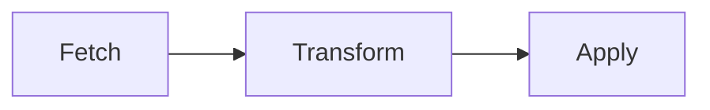

# Kannika Bridge 🌉

[](https://github.com/cymo-eu/kannika-bridge/actions/workflows/ci.yml)

> ✉️ 🚀 Restore consumer offsets on kafka cluster.

A powerful tool for migrating Kafka consumer group offsets between clusters, enabling seamless cluster migrations and disaster recovery scenarios.

## How does it work

The restoration comes in 3 steps. 
Each of these steps can be performed separately and the result can be checked before proceeding to the next step.



1. **Fetch** source offsets from the source cluster - retrieves committed consumer group offsets
2. **Transform** offsets - maps source offsets to equivalent positions on the target cluster using message headers
3. **Apply** transformed offsets to the target cluster - commits the calculated offsets for consumer groups

### Use Cases

- **Cluster Migration**: Move consumer groups from one Kafka cluster to another
- **Disaster Recovery**: Restore consumer positions after cluster failures
- **Environment Promotion**: Sync consumer states between dev/staging/production
- **Data Replication**: Maintain consumer offset consistency across replicated clusters

### Prerequisites

- Kafka clusters must be accessible via bootstrap servers
- Consumer groups must exist on both source and target clusters
- Messages on target cluster must contain source offset information in headers (for transformation step)
- Appropriate permissions to read consumer group metadata and commit offsets

## Installation

### From Releases

1. Download the latest binary for your platform from the [releases page](https://github.com/cymo-eu/kannika-bridge/releases)
2. Extract the archive
3. Move the `kbridge` binary to a directory in your `$PATH`

### Linux

```bash
# Download and install (replace VERSION with actual version)
curl -L https://github.com/cymo-eu/kannika-bridge/releases/download/vVERSION/bridge-cli-linux.tar.gz | tar xz
sudo mv bridge-cli /usr/local/bin/
```

### macOS

```bash
# Download and install (replace VERSION with actual version)
curl -L https://github.com/cymo-eu/kannika-bridge/releases/download/vVERSION/bridge-cli-macos.tar.gz | tar xz
sudo mv bridge-cli /usr/local/bin/
```

### Windows

Download the Windows executable from the releases page and add it to your PATH.

### Build from Source

```bash
git clone https://github.com/cymo-eu/kannika-bridge.git
cd kannika-bridge
cargo build --release
# Binary will be in target/release/bridge-cli
```

## Usage

### Basic Commands

```bash
# Show help
bridge-cli --help

# Show help for specific command
bridge-cli fetch-source --help
bridge-cli calculate-target --help
bridge-cli apply-target --help
```

### Simple Local Example

Against local source (localhost:9092) and target (localhost:9093) clusters:

```bash
# Step 1: Fetch offsets from source cluster
bridge-cli fetch-source -b localhost:9092 > source_offsets.csv

# Step 2: Calculate target offsets
bridge-cli calculate-target -b localhost:9093 -l Offset -i source_offsets.csv > target_offsets.csv

# Step 3: Apply target offsets (with confirmation prompt)
bridge-cli apply-target -b localhost:9093 -i target_offsets.csv
```

### Chained Pipeline

All steps can be chained together for streamlined execution:

```bash
kbridge fetch -b localhost:9092 | \
kbridge calculate -b localhost:9093 -l Offset | \
kbridge apply -b localhost:9093
```

> ⚠️ **Safety First**: Before applying offsets, a confirmation prompt is shown to prevent accidental modifications.

### Authentication Examples

#### SASL/SSL (Confluent Cloud)

```bash
kbridge fetch-source -b <bootstrap-url> \
    -o security.protocol=sasl_ssl \
    -o sasl.mechanism=PLAIN \
    -o sasl.username=<api-key> \
    -o sasl.password=<api-secret> \
    -o ssl.ca.location=probe
```

#### SASL/PLAINTEXT

```bash
bridge-cli fetch-source -b <bootstrap-url> \
    -o security.protocol=sasl_plaintext \
    -o sasl.mechanism=SCRAM-SHA-256 \
    -o sasl.username=<username> \
    -o sasl.password=<password>
```

#### SSL with Client Certificates

```bash
bridge-cli fetch-source -b <bootstrap-url> \
    -o security.protocol=ssl \
    -o ssl.ca.location=/path/to/ca-cert \
    -o ssl.certificate.location=/path/to/client-cert \
    -o ssl.key.location=/path/to/client-key
```

### Advanced Options

#### Filter by Topics

```bash
# Only process specific topics
bridge-cli fetch-source -b localhost:9092 -t topic1 -t topic2 -t topic3
```

#### Custom Header Key

```bash
# Use custom header key for offset mapping
bridge-cli calculate-target -b localhost:9093 -l CustomOffsetHeader -i offsets.csv
```

### CSV Format

The tool uses CSV format for offset data with the following columns:

```csv
consumer_group,topic,partition,offset
my-consumer-group,orders,0,12345
my-consumer-group,orders,1,12346
my-consumer-group,payments,0,5678
```

## Troubleshooting

### Common Issues

#### "Consumer group not found"
- Ensure the consumer group exists on the target cluster
- Verify you have permissions to read consumer group metadata

#### "No headers in message" or "Header not found"
- Messages on the target cluster must contain source offset information in headers
- Verify the header key matches what you specified with `-l` flag
- Check that your replication process is preserving message headers

#### "Kafka Error: Authentication failed"
- Verify your authentication credentials
- Check that security protocol matches your cluster configuration
- Ensure your user has necessary permissions (read consumer groups, commit offsets)

#### "Connection refused"
- Verify bootstrap server addresses are correct and accessible
- Check network connectivity and firewall rules
- Ensure Kafka cluster is running and healthy

### Debug Mode

Enable verbose logging for troubleshooting:

```bash
RUST_LOG=debug bridge-cli fetch-source -b localhost:9092
```

### Dry Run

To see what offsets would be applied without actually committing them:

```bash
# Calculate and review target offsets before applying
bridge-cli fetch-source -b source:9092 | \
bridge-cli calculate-target -b target:9093 -l Offset > review_offsets.csv

# Review the CSV file, then apply if satisfied
bridge-cli apply-target -b target:9093 -i review_offsets.csv
```

## Contributing

1. Fork the repository
2. Create a feature branch (`git checkout -b feature/amazing-feature`)
3. Commit your changes (`git commit -m 'Add amazing feature'`)
4. Push to the branch (`git push origin feature/amazing-feature`)
5. Open a Pull Request

### Development Setup

```bash
# Clone the repository
git clone https://github.com/cymo-eu/kannika-bridge.git
cd kannika-bridge

# Install Rust (if not already installed)
curl --proto '=https' --tlsv1.2 -sSf https://sh.rustup.rs | sh

# Build the project
cargo build

# Run tests
cargo test

# Run with sample data
cargo run -- fetch-source -b localhost:9092
```

## License

TODO

## Support

- 📖 [Documentation](https://github.com/cymo-eu/kannika-bridge/wiki)
- 🐛 [Issue Tracker](https://github.com/cymo-eu/kannika-bridge/issues)
- 💬 [Discussions](https://github.com/cymo-eu/kannika-bridge/discussions)

